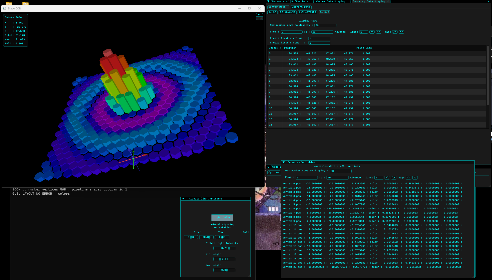

## Shader Constructor (SCON)

Shader Constructor (SCON) is a set of C++ OpenGL GLSL pipeline classes to emulate as a toolkit, the coding and functionality of the OpenGL GLSL pipeline vertex and geometry shaders for the purpose of developing and debugging GLSL shader programs.

## Introduction

The purpose of SCON is for the user to write, compile and execute GLSL shader emulation code for the purpose of developing and creating GLSL application code with the power of inspecting and debugging the emulated GLSL shader code in real time. Once it is satisfied that the emulation code is correct and functional, it can be translated into a true GLSL shader program to be compiled and used within a true OpenGL GLSL application. It is not intended to be a substitute for OpenGL GLSL applications.

Many GLSL debugging tools such as RenderDoc or Nsight require a snapshot or a frozen OpenGL frame of an OpenGL application to inspect the data and uniform variables of a GLSL shader program. SCON can not only display the input and output vertex attribute data and uniform data in real time as the user interacts with the emulated GLSL shader program, but also the shader variable data which RenderDoc and Nsight cannot display for inspection and debugging.

## Installation:

This project is a Visual Studio 2022 ISO C++ 20 Standard project set up for windows. 

1 : Download the files within the ShaderCON repository to a desired directory location.

2 : Open visual studio and open the visual studio project shaderCON.sln file.

3 : A SCON emulation program should aready be initiated. Compile and run the code. 

4 : In the Documentation directory should be a pdf file. Open it to read to obtain a detailed description and guide to using and coding the SCON C++ OpenGL GLSL shader pipeline emulation.

5: For a non visual studio IDE, assign additional include directories for source as the project directory (ProjectDir) defined in step 1, and the thirdparty directory (ProjectDir)thirdparty.

## Dependencies
    These are a list of the current third party dependacies for this project

    glfw
    glew
    ImGui
    imgui-docking
    ImGuiFileDialog
    glm
    stb_image
    tiny_obj_loader
    tinyply
    tinyxml
    utf8
    glad
    spdlog
    assimp

Dependency source header files to be defined where $(ProjectDir) is the project directory where the header files are located

    $(ProjectDir)thirdparty\assimp
    $(ProjectDir)thirdparty\glew\include
    $(ProjectDir)thirdparty\glfw\include
    $(ProjectDir)thirdparty\glm-1.0.1
    $(ProjectDir)thirdparty\ImGUI\imgui_docking
    $(ProjectDir)thirdparty\ImGUI\imgui_docking\backends
    $(ProjectDir)thirdparty\stb_image\include
    $(ProjectDir)thirdparty\tiny_obj_loader\include
    $(ProjectDir)thirdparty\tinyply\include
    $(ProjectDir)thirdparty\tinyxml\include
    $(ProjectDir)thirdparty\ImGuiFileDialog
    $(ProjectDir)thirdparty\utf8\include
    $(ProjectDir)thirdparty\glad\include
    $(ProjectDir)thirdparty\spdlog\include

Dependency libs to be defined where $(ProjectDir) is the project directory where the lib files are located

    $(ProjectDir)libs\Release\glfw3.lib
    $(ProjectDir)libs\Release\glew32.lib
    $(ProjectDir)libs\Release\spdlog.lib
    $(ProjectDir)libs\Release\assimp-vc142-mtd.lib
    $(ProjectDir)libs\Release\imgui_gradient.lib 
    opengl32.lib

Note : The existing lib files have been compiled for visual studio SDK 10.0 version using  ISO C++ 20 language standard. Thus may not work for other versions of visual  studio and C++ language standard and need to be recompiled.

## Source Code

Because this is a working project, within the source code is a lot of debugging code that has largely been commented out.

Much of the code has been written for as easy reading as much as possible to understand what the code does and is for. However some of the code that has been adopted or copied from 3rd parties may follow a different naming convention.

